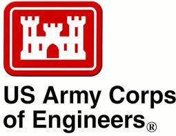

# JupyterCon-2018
Using JupyterLab for flood map development: Approaches for improving productivity and reproducibility

[JupyterCon](https://conferences.oreilly.com/jupyter/jup-ny/public/schedule/detail/68295), August 24, 2018 
New York City, NY 

---

  
 [__Resilience Solutions Group__](http://www.dewberry.com/)
 
 ---

### Our Clients

---

## Contents 
 
#### Rationale for this talk  
 1. (Proprietary) Tool diversity 
  - Cost
  - Learning curve
  - Silos
 - Conceptualizing Workflows- technical & non-technical 
 - Reproducibility & Traceability
 - Copy/Paste
 - Standard Models 
 - Interactivity
 - Quality Control
 - Batch processing
---

#### Riverine Modeling: Proven Models, New Approaches

Notebooks created by [STARR II](http://www.starr-team.com/starr/Pages/default.aspx) (Strategic Alliance for Risk Reduction) in support of FEMA.

 - [Monte Carlo Approaches (html)](Pluvial_Development.html) *Conceptualizing Workflows*
 - [USGS API](GageExplorer.ipynb)
  *Copy/Paste*
 - [Model Development (html)](BreachTool.html) *Standard Models, Reproducibility & Traceability* 
 - [Data Visualization (html)](HydrographDeveloper.html) *Interactivity*

---

#### Coastal Modeling: Finite Element Methods

Notebooks developed by [Tyler Miesse](https://github.com/tmiesse) for production runs of the coupled hydrodynamic and wave models ADCIRC + SWAN. 

 - [Model Development](tmiesse/ModelSetup.ipynb) *Silos, Learning curve* 
 - [Model Validation](tmiesse/noaa_tide.ipynb) *Copy/Paste, Interactivity*
 - [Production QAQC](tmiesse/ModelQC.ipynb) *Quality Control*
 - [Troubleshooting QAQC](tmiesse/Model_output.ipynb) Quality Control, Visualization*

 ---
 
#### GIS Integration: Mapping & Analysis

Notebooks for working with vector and raster datasets common in flood risk analysis.

 - [Vector Datasets](abrazeau/Poly_to_Line_json.ipynb) *Learning Curve, Cost, Reproducibility & Traceability*
 - [Raster Datasets](abrazeau/ConvertTiffs_Batch.ipynb)  *Learning Curve, Cost, Reproducibility & Traceability*
 - [Batch Processing with CL Tools](abrazeau/gdal_warp_Tiffs_Batch.ipynb) *Batch Processing*
 
# END
